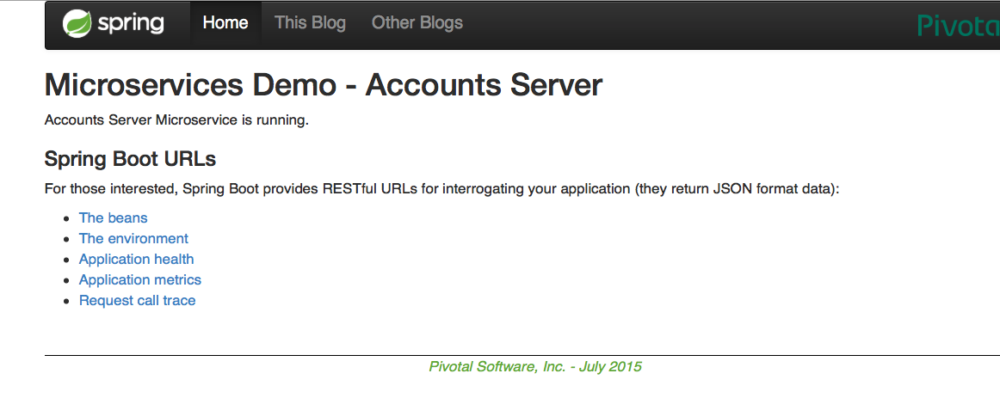
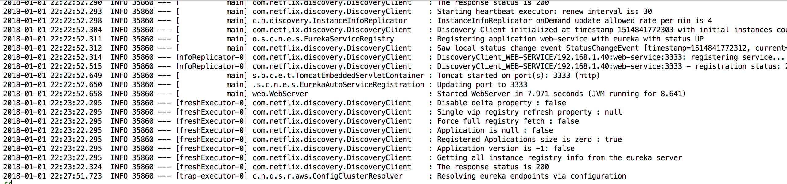
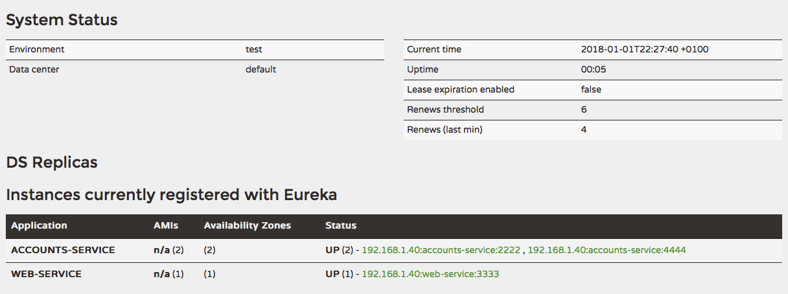

# Tareas Lab 6

###Two microservices running and registered

* Account service running

* Web service running

###Service registration has the two microservices registered

###Second account microservice running in port 4444 and registered

###What happens when you kill the microservice with port 2222? Can the web service provide information about the accounts? Why?
When the account server (port:2222) is killed and the web server attempts to provide information about the accounts, it returns a Connection Refused error because the port is inactive. When the web server tries to connect again, it will ask the Registration server to obtain the valid Account server addres. It gets the correct account server (port:4444) and it is able to return the information.